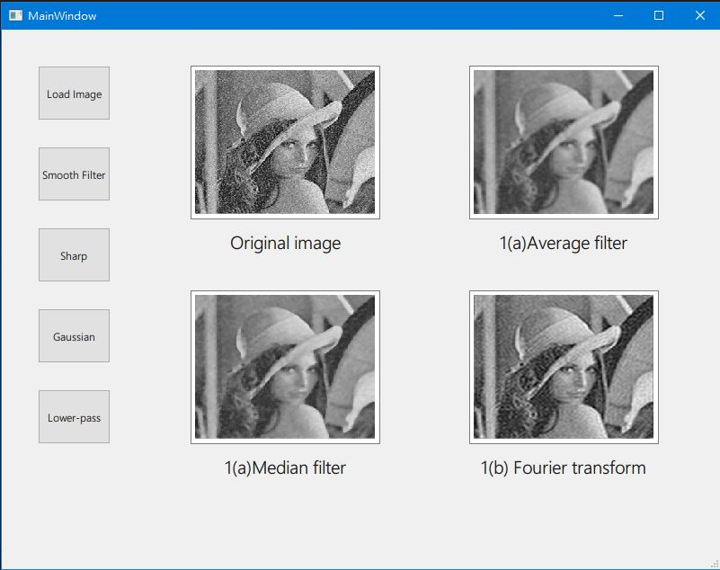
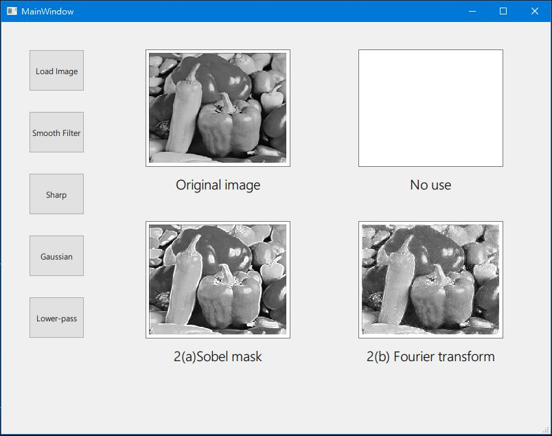
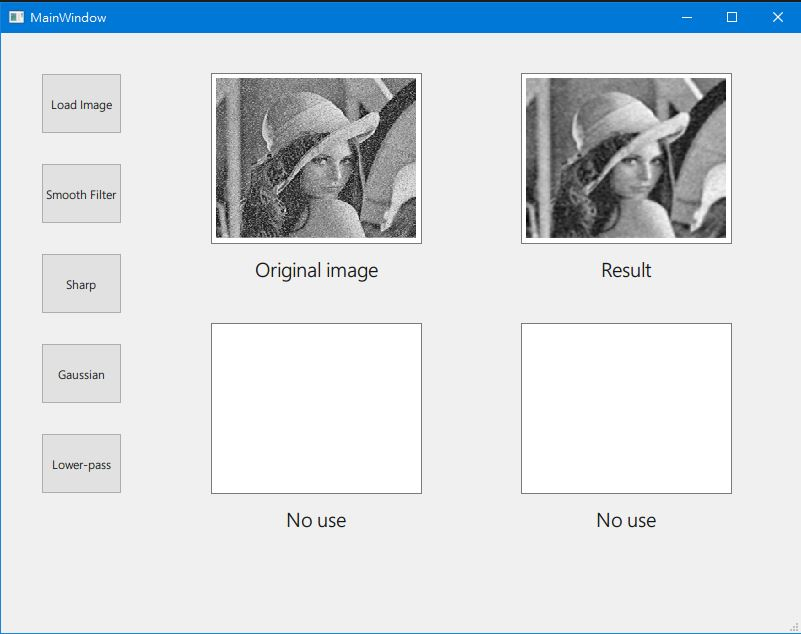
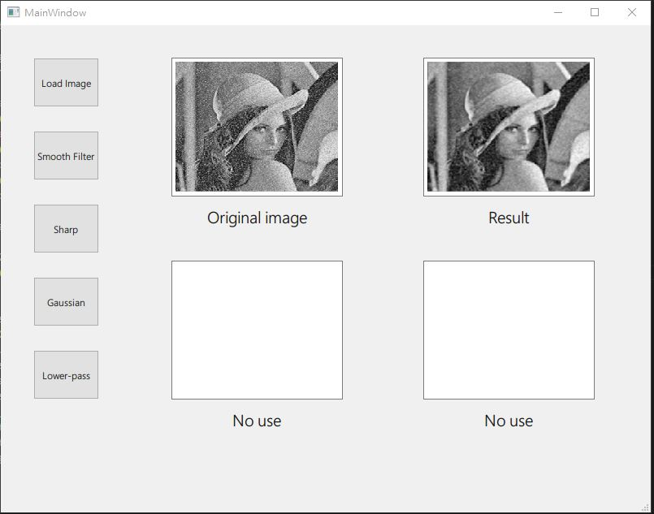

Q1- Use opencv blur function and Fourier_transform_Filter to remove noises

Q2- Use sobel_mask and Fourier transform to sharp the edge of image

Q3- Use Gaussian 5*5 mask to smooth the image and remove noises

Q4- Use Gaussian lowpass filter to smooth the image 

